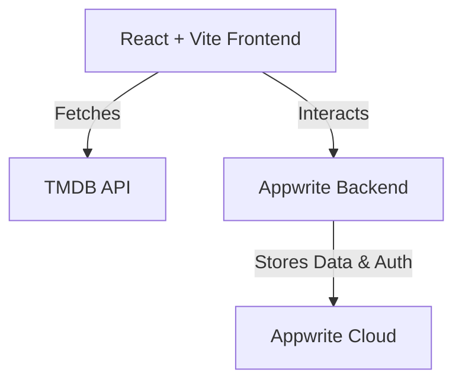

# 🎬 Movie Explorer  

  
  
  
  
  
  
  

A **modern, high-performance web application** for intuitive movie discovery and search, built using **React**, **Vite**, **Tailwind CSS**, and powered by an Appwrite backend.

---

## ✨ Overview  

**Movie Explorer** delivers a sleek platform to **search, explore, and discover movies**. It features **real-time trending content**, fast and accurate search, and full movie details using the **TMDB API**, all wrapped in a responsive, visually appealing UI.

---

## 🚀 Key Features  

- 🔍 **Optimized Movie Search**  
  Lightning-fast and accurate search by title.

- 🔥 **Dynamic Trending Feed**  
  Real-time trending movies for effortless discovery.

- 🎨 **Intuitive UI**  
  Built with **Tailwind CSS**, offering a clean and responsive interface.

- 📱 **Fully Responsive**  
  Seamless experience across all devices—desktops, tablets, and smartphones.

- ⚡ **Blazing Fast Performance**  
  Powered by **Vite** for ultra-fast development and build times.

- 📡 **Live Movie Data**  
  Movie metadata, posters, trailers, cast info pulled directly from **TMDB API**.

---

## 🛠 Tech Stack  

- **Frontend:** `React.js`, `Vite`, `Tailwind CSS`  
- **Backend:** `Appwrite` (authentication, database, storage)  
- **API:** `TMDB API` for movie data  

---

## 🏗 Architecture Overview  


---

## 🌐 Live Demo  

Check it out live: [**Movie Explorer on Vercel**](https://movie-application-chi-khaki.vercel.app/)

---

## ⚙️ Getting Started  

### ✅ Prerequisites  

- [Node.js](https://nodejs.org/) (LTS recommended)  
- `npm` or `Yarn`  
- Appwrite Project (backend setup)  
- TMDB API Key ([Get one here](https://www.themoviedb.org/))  

---

### 📂 Installation  

**1. Clone the repository**
```bash
git clone https://github.com/sathvik-04/movie-application.git
cd movie-application

**2. Install dependencies**
```bash
npm install
```

**3. Configure Environment Variables**

Create a `.env` file in the root directory and add the following:

```env
VITE_APPWRITE_ENDPOINT=your-appwrite-endpoint
VITE_APPWRITE_PROJECT_ID=your-appwrite-project-id
VITE_TMDB_API_KEY=your-tmdb-api-key
```
---

### ▶️ Run the Application

Start the development server:

```bash
npm run dev
```
📜 License

## 📄 License
This project is licensed under the [MIT License](LICENSE).


🤝 Contributing

Contributions are welcome! Please follow these steps:

 1. Fork the repository

 2. Create your feature branch (git checkout -b feature-name)

 3. Commit your changes (git commit -m 'Add some feature')

 4. Push to the branch (git push origin feature-name)

 5. Open a Pull Request

⭐ Show Your Support

If you like this project, give it a star ⭐ on GitHub
!


---

## 🔮 Future Enhancements

Here are some planned improvements for upcoming releases:

- ✅ **User Authentication & Profiles**  
  Enable users to create accounts, save favorite movies, and manage watchlists.

- 🎭 **Genre & Filter Options**  
  Filter movies by genre, rating, language, and release date.

- 🌙 **Dark Mode**  
  Add a toggle for light/dark themes for better UX.

- 💬 **User Reviews & Ratings**  
  Allow users to review and rate movies.

- 🖼 **Improved UI with Animations**  
  Add smooth transitions and motion effects using Framer Motion.

- 📲 **PWA Support**  
  Make the app installable as a Progressive Web App for offline usage.

- 🔔 **Notifications for Trending Movies**  
  Push notifications for trending movies or upcoming releases.

- 🌍 **Multi-Language Support**  
  Add localization for different languages.

---


